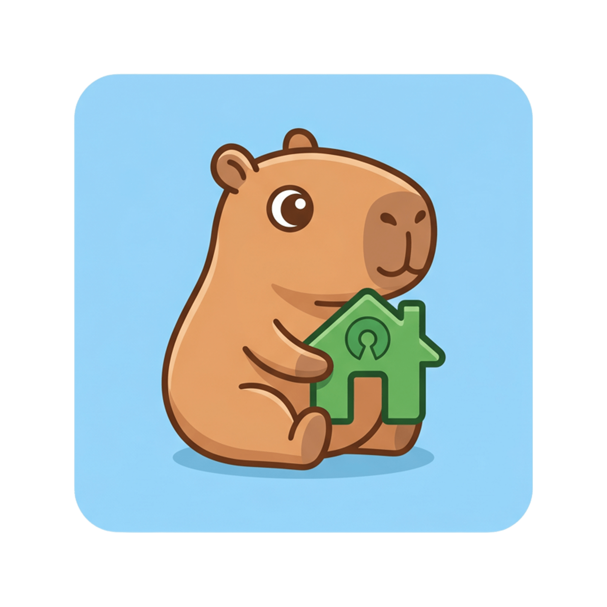
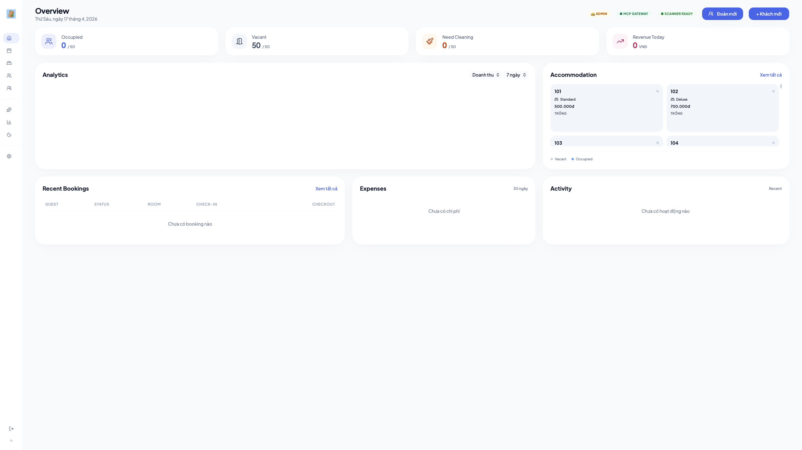
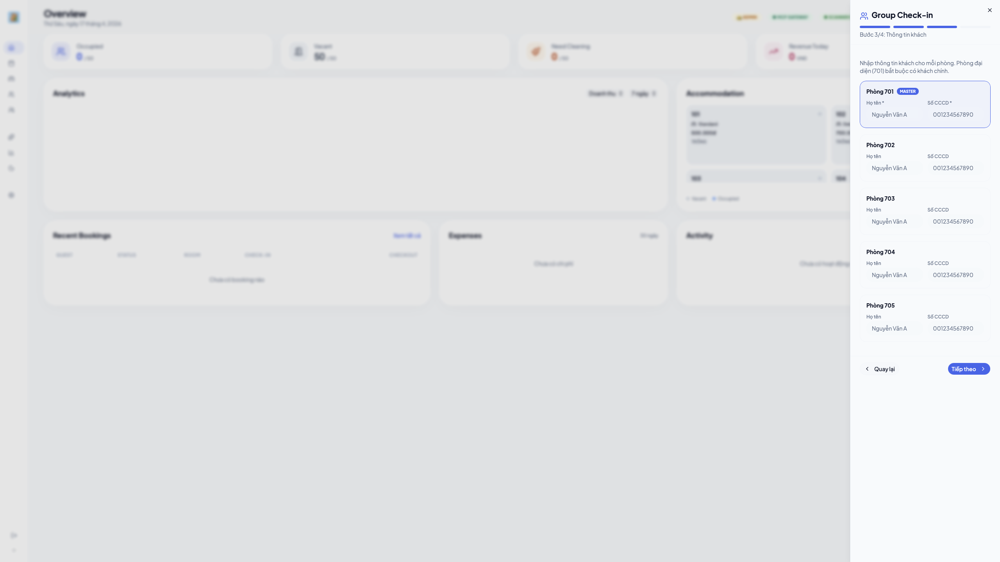
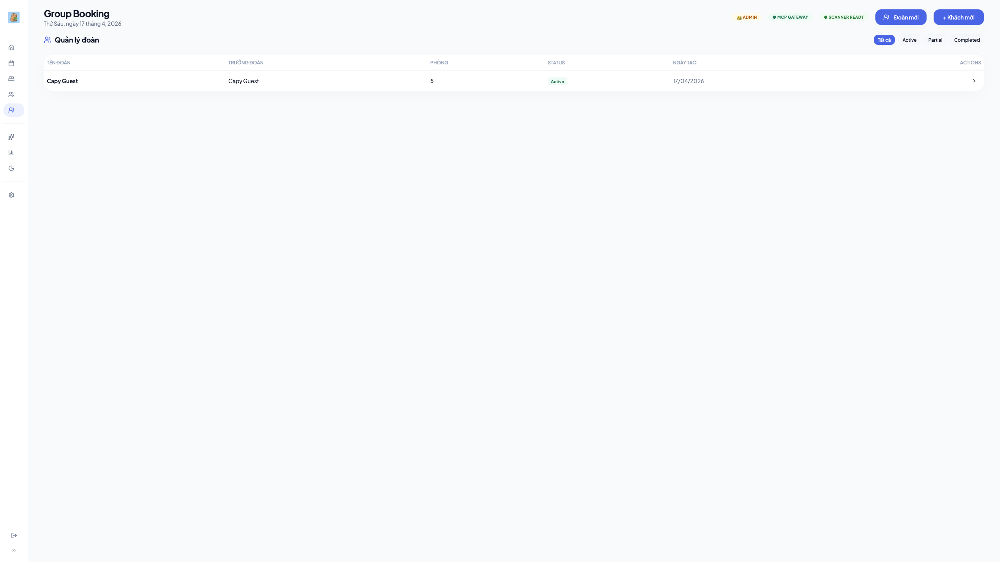
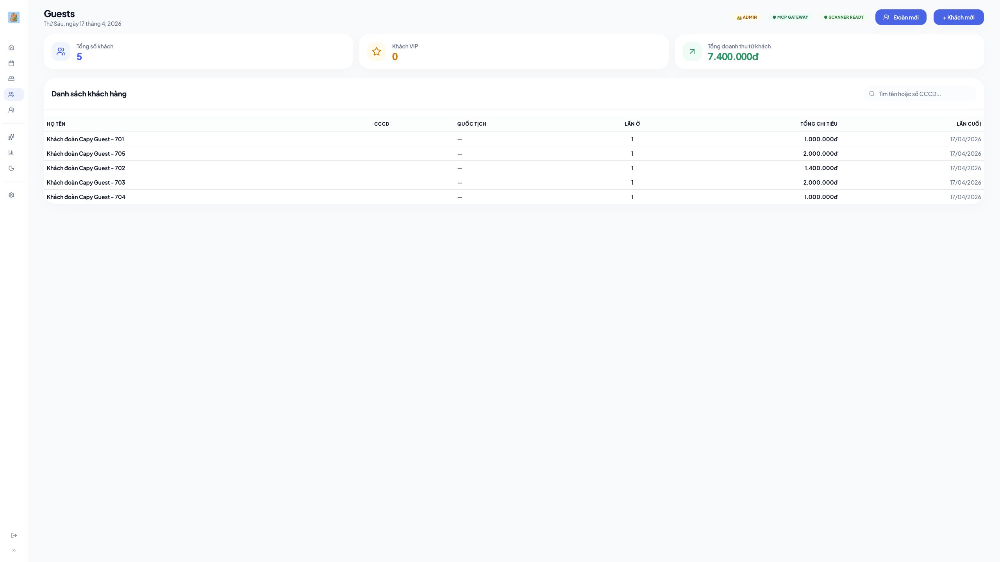
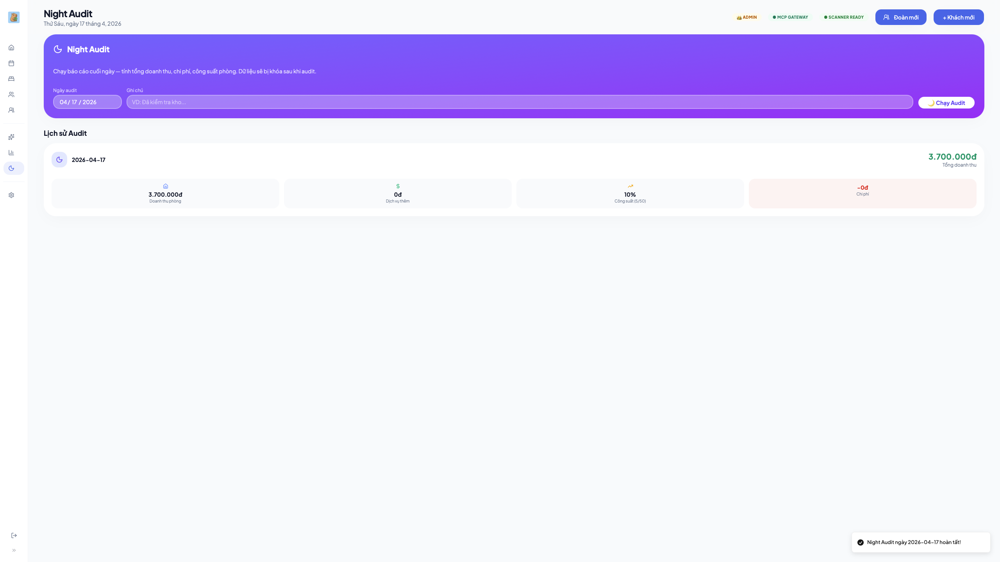
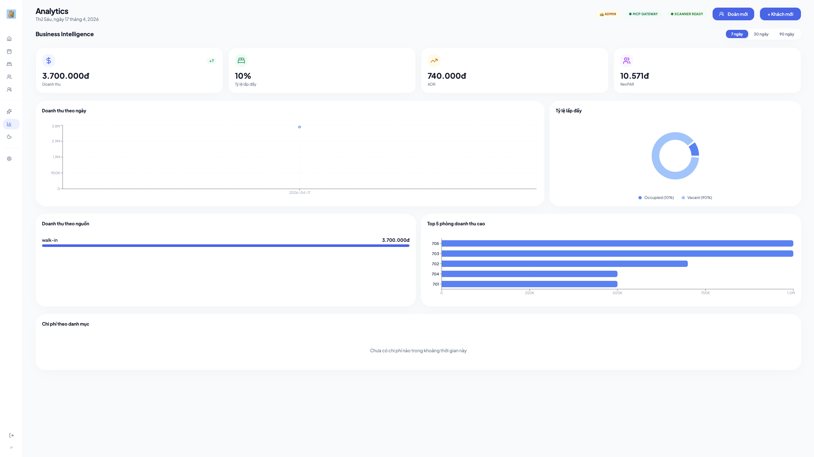
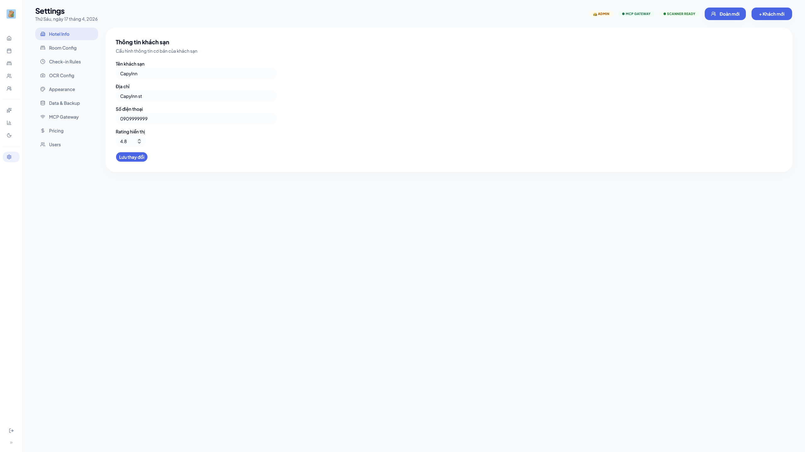
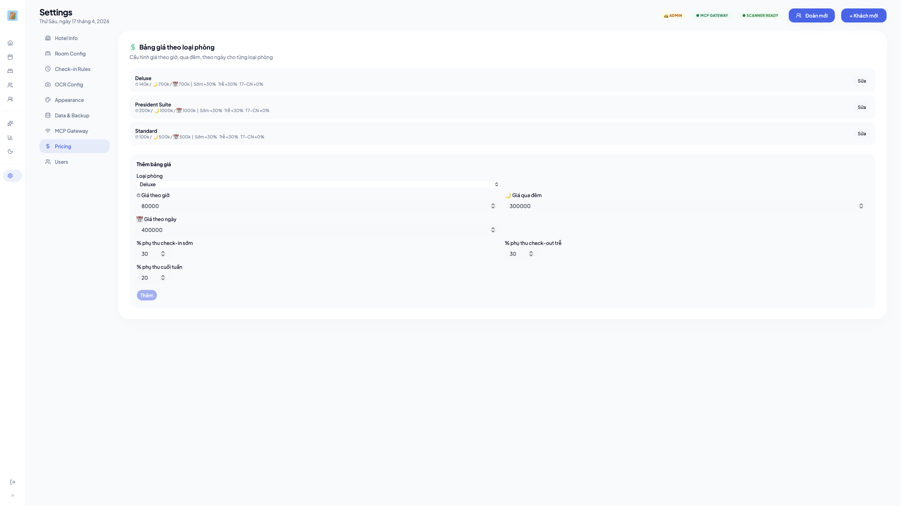

<div id="top" align="center">



# CapyInn

**Offline-first property management software for mini hotels**

*A desktop PMS for small hotels and guesthouses in Vietnam.*

[](https://github.com/chuanman2707/CapyInn/actions/workflows/ci.yml)
[](LICENSE)
[](https://tauri.app)
[](https://www.rust-lang.org)
[](https://react.dev)
[](https://sqlite.org)
[](https://www.typescriptlang.org)

**Property onboarding · Vietnamese ID OCR · Check-in/check-out · Reservations · Night audit**

<p>
  <a href="#what-capyinn-solves"><strong>Why CapyInn</strong></a> ·
  <a href="#product-demo"><strong>Demo</strong></a> ·
  <a href="#key-features"><strong>Features</strong></a> ·
  <a href="#local-development"><strong>Local development</strong></a> ·
  <a href="#verification"><strong>Verification</strong></a>
</p>

</div>



> Built for mini hotels that need one local app for room status, guest intake, nightly billing, housekeeping, and end-of-day reconciliation.

<p align="center">
  
  
  
  
</p>

CapyInn is a desktop app for mini hotels and guesthouses that need a local-first operating tool without relying on a remote backend. The project focuses on real front-desk workflows: room layout setup, faster guest intake, Vietnamese ID OCR, nightly pricing, housekeeping, revenue reporting, and end-of-day reconciliation.

> Note: `CapyInn` is a clean-slate rename from `MHM`. Current builds use the new runtime root at `~/CapyInn` and do not auto-migrate legacy local data from `~/MHM`.

<details>
<summary>Table of contents</summary>

- [What CapyInn solves](#what-capyinn-solves)
- [Product demo](#product-demo)
- [Key features](#key-features)
- [Tech stack](#tech-stack)
- [System requirements](#system-requirements)
- [Local development](#local-development)
- [Verification](#verification)
- [Repository layout](#repository-layout)
- [Known limitations](#known-limitations)
- [Additional docs](#additional-docs)
- [Contributing](#contributing)
- [License](#license)

</details>

## What CapyInn solves

CapyInn is built for a narrow but practical use case: small hotels that need a system they can run locally, control directly, and adopt without a long setup project.

| Before | With CapyInn |
| --- | --- |
| Handwritten logs and fragmented tracking | Room status, bookings, and transactions live in one app |
| Manual guest registration entry | OCR extracts Vietnamese ID details and speeds up intake |
| Nightly pricing calculated by hand | Check-in, extend-stay, check-out, and folio flows are automated |
| End-of-day reporting done manually | Dashboard, analytics, expenses, and night audit are built in |
| Initial setup takes too much time | Onboarding generates room types, layouts, and operating defaults |

## Product demo

### Dashboard


### Guest check-in and booking flow

<p align="center">
  
  
</p>

### Guest profile and operations

<p align="center">
  
  
</p>

### Analytics and settings

<p align="center">
  
  
</p>

<p align="center">
  
</p>

## Key features

### Onboarding and property setup

- Configure hotel identity, check-in and check-out rules, invoice details, and app lock
- Create room types and default pricing during the first-run wizard
- Generate a room layout by floors, room count, and naming scheme

### Front-desk operations

- Dashboard organized around the configured room layout
- Check-in, check-out, extend-stay, and reservation flows in one desktop app
- Support for multiple guests on the same booking
- Fast copy flow for guest registration details

### Vietnamese ID OCR

- Local OCR powered by PaddleOCR v5 through `ocr-rs`
- Watches `~/CapyInn/Scans/` for new scan files
- Extracts guest name, national ID number, birth date, and address for check-in

### Billing, payments, and reporting

- Night-based pricing by room type
- Charge, payment, deposit, and balance tracking
- Revenue analytics, expense tracking, and CSV export

### Housekeeping and night audit

- Post-checkout housekeeping state tracking
- Maintenance notes per room
- Night-audit flow for daily reconciliation

### MCP and automation integrations

- CapyInn can be extended through MCP-friendly workflows for operator tooling and agent-driven automations
- These flows can be paired with OpenClaw and n8n for custom orchestration around hotel operations
- For Zalo personal chat automations, you can use the prebuilt community node [`n8n-nodes-zca-zalo`](https://www.npmjs.com/package/n8n-nodes-zca-zalo), published on npm and built on top of `zca-js`

## Tech stack

| Layer | Technology |
| --- | --- |
| App shell | Tauri 2 |
| Backend | Rust + SQLite (`sqlx`) |
| Frontend | React 19 + TypeScript |
| State | Zustand |
| UI | Tailwind CSS 4 + shadcn/ui |
| OCR | `ocr-rs` + PaddleOCR v5 + MNN |
| Charts | Recharts |
| Tests | Vitest + Rust tests + Clippy |

## System requirements

| Component | Requirement |
| --- | --- |
| macOS | 12+ |
| Node.js | 20+ |
| Rust | stable via `rustup` |
| Xcode CLT | recent version |
| Disk footprint | roughly 25MB before operational data |

The project is currently verified most heavily on macOS and Apple Silicon.

## Local development

### Install prerequisites

```bash
curl --proto '=https' --tlsv1.2 -sSf https://sh.rustup.rs | sh
source ~/.cargo/env
xcode-select --install
node --version
```

### Clone and run the desktop app

```bash
git clone https://github.com/chuanman2707/CapyInn.git
cd CapyInn/mhm
npm ci
npm run tauri dev
```

### Build a release bundle

```bash
cd CapyInn/mhm
npm run tauri build
```

Release bundles are generated under `mhm/src-tauri/target/release/bundle/`.

## Verification

```bash
cd CapyInn/mhm
npm test
npm run build
cargo check --manifest-path src-tauri/Cargo.toml
cargo test --manifest-path src-tauri/Cargo.toml
cargo clippy --manifest-path src-tauri/Cargo.toml --all-targets -- -D warnings
```

If you only need the web UI during frontend work:

```bash
cd CapyInn/mhm
npm run dev
```

## Repository layout

```text
CapyInn/
├── Public/                 # README demo screenshots
├── mhm/
│   ├── src/                # React UI, stores, pages, components
│   ├── src-tauri/          # Rust backend, IPC commands, DB, gateway, OCR
│   ├── tests/              # Vitest suites and mocked desktop flows
│   ├── public/             # Static assets
│   └── models/             # OCR models
├── PRD.md                  # Product requirements
├── CONTRIBUTING.md
├── SECURITY.md
└── README.md
```

## Known limitations

- OCR is currently optimized for Vietnamese national ID cards; passports and international documents are not complete yet
- Windows and Linux are not first-class targets yet
- The project is designed for mini-hotel scale, not large chain operations

## Additional docs

- [PRD](PRD.md)
- [Contributing guide](CONTRIBUTING.md)
- [Security policy](SECURITY.md)
- [Changelog](CHANGELOG.md)

## Contributing

Read [CONTRIBUTING.md](CONTRIBUTING.md) before opening a pull request.

Short checklist:

1. Fork the repository
2. Create a branch from `main`
3. Keep commit messages in Conventional Commits format
4. Re-run `npm test`, `npm run build`, `cargo check`, `cargo test`, and `cargo clippy`
5. Open a pull request with scope and verification notes

## License

CapyInn is released under the [MIT License](LICENSE).
