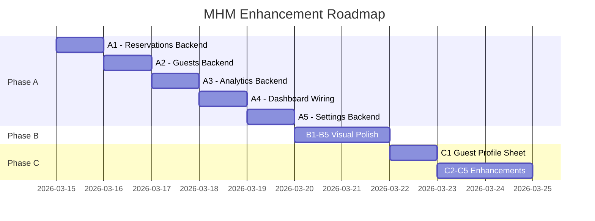

# PLAN: Backend Wiring + Visual Polish + New Features

> **3-Phase plan** để đưa MHM từ mock data → production-ready, theo đúng thứ tự ưu tiên.

---

## Phase A: Wire Backend *(Ưu tiên cao nhất)*

> Kết nối tất cả trang frontend đang dùng mock data sang data thật từ SQLite.

### A1. Reservations — `get_all_bookings`

#### [MODIFY] `src-tauri/src/models.rs`
```rust
// New structs
pub struct BookingFilter {
    pub status: Option<String>,   // "active" | "completed" | "upcoming"
    pub from: Option<String>,
    pub to: Option<String>,
}

pub struct BookingWithGuest {
    pub booking: Booking,
    pub guest_name: String,
    pub room_id: String,
    pub room_name: String,
}
```

#### [MODIFY] `src-tauri/src/commands.rs`
- **New:** `get_all_bookings(filter: Option<BookingFilter>)` 
- SQL: JOIN `bookings` + `guests` + `rooms`, filter by status/date, ORDER BY `check_in_at DESC`

#### [MODIFY] `src/pages/Reservations.tsx`
- Replace `MOCK_BOOKINGS` → call `invoke("get_all_bookings")` in useEffect
- Map real booking dates to Gantt bar positions

#### [MODIFY] `src-tauri/src/lib.rs`
- Register `get_all_bookings` in handler

---

### A2. Guests — `get_all_guests` + `get_guest_history`

#### [MODIFY] `src-tauri/src/models.rs`
```rust
pub struct GuestSummary {
    pub id: String,
    pub full_name: String,
    pub doc_number: String,
    pub nationality: Option<String>,
    pub total_stays: i32,
    pub total_spent: f64,
    pub last_visit: Option<String>,
}

pub struct GuestHistory {
    pub guest: Guest,
    pub bookings: Vec<BookingWithRoom>,
}

pub struct BookingWithRoom {
    pub booking_id: String,
    pub room_id: String,
    pub check_in_at: String,
    pub expected_checkout: String,
    pub total_price: f64,
    pub status: String,
}
```

#### [MODIFY] `src-tauri/src/commands.rs`
- **New:** `get_all_guests(search: Option<String>)` — aggregate query with COUNT + SUM from bookings
- **New:** `get_guest_history(guest_id: String)` — guest info + all bookings joined with rooms

#### [MODIFY] `src/pages/Guests.tsx`
- Replace `MOCK_GUESTS` → `invoke("get_all_guests", { search })`
- Debounce search input (300ms delay)

#### [MODIFY] `src-tauri/src/lib.rs`
- Register `get_all_guests`, `get_guest_history`

---

### A3. Analytics — `get_analytics`

#### [MODIFY] `src-tauri/src/models.rs`
```rust
pub struct AnalyticsData {
    pub total_revenue: f64,
    pub occupancy_rate: f64,
    pub adr: f64,               // Average Daily Rate
    pub revpar: f64,            // Revenue Per Available Room
    pub daily_revenue: Vec<DailyRevenue>,  // reuse existing struct
    pub revenue_by_source: Vec<SourceRevenue>,
    pub expenses_by_category: Vec<CategoryExpense>,
    pub top_rooms: Vec<RoomRevenue>,
}
```

#### [MODIFY] `src-tauri/src/commands.rs`
- **New:** `get_analytics(period: String)` — "7d" | "30d" | "90d"
- Reuse existing `get_revenue_stats` SQL patterns, add source breakdown + room ranking
- Expenses from `expenses` table grouped by category

#### [MODIFY] `src/pages/Analytics.tsx`
- Replace all `REVENUE_DATA`, `SOURCE_DATA`, `TOP_ROOMS`, `EXPENSE_DATA` → `invoke("get_analytics")`

#### [MODIFY] `src-tauri/src/lib.rs`
- Register `get_analytics`

---

### A4. Dashboard — Wire real activity + expenses

#### [MODIFY] `src-tauri/src/commands.rs`
- **New:** `get_recent_activity(limit: i32)` — UNION of recent bookings, checkouts, and housekeeping events, ordered by timestamp
- Reuse existing `get_expenses` for expense widget (already exists!)

#### [MODIFY] `src/pages/Dashboard.tsx`
- Replace `ACTIVITY_FEED` → `invoke("get_recent_activity", { limit: 10 })`
- Replace `EXPENSE_CATEGORIES` → `invoke("get_expenses", { from, to })`
- `MOCK_CHART_DATA` → derive from `get_revenue_stats` (already exists!)
- `MOCK_GUESTS` → derive from `get_all_bookings` with limit

---

### A5. Settings — `update_room` + `export_data`

#### [MODIFY] `src-tauri/src/commands.rs`
- **New:** `update_room(room_id: String, base_price: Option<f64>, room_type: Option<String>)` — UPDATE rooms SET
- **New:** `export_csv()` — query all tables, write CSV to `~/MHM/exports/`, return file path

#### [MODIFY] `src/pages/Settings.tsx`
- Room Config: fetch rooms, inline edit price, call `update_room` on save
- Data section: call `export_csv`, open file in Finder

---

### Phase A Summary

| Command | SQL Complexity | Existing Code to Reuse |
|---------|---------------|----------------------|
| `get_all_bookings` | JOIN 3 tables | `get_room_detail` pattern |
| `get_all_guests` | Aggregate + LIKE | `get_rooms` pattern |
| `get_guest_history` | JOIN bookings+rooms | `get_room_detail` pattern |
| `get_analytics` | Multiple aggregates | `get_revenue_stats` |
| `get_recent_activity` | UNION + ORDER | New |
| `update_room` | Simple UPDATE | New |
| `export_csv` | SELECT * + file write | New |

**Total new Rust commands:** 7
**Estimated effort:** 2-3 sessions

---

## Phase B: Visual Polish *(Sau khi backend hoạt động)*

> Review từng trang, matching Reservo 1:1 về layout và UX.

### B1. Reservations Polish
- Booking bars: add check-in time badge (e.g., "⏰ 11:30 AM")
- Add right-click context menu (view details, cancel)
- Scroll-to-today on page load

### B2. Dashboard Polish
- Accommodation section: click room → navigate to Rooms tab (not just room detail)
- Guests table: "Show all" → navigate to Guests tab
- Add subtle micro-animations on widget load

### B3. Rooms Page Polish
- Room detail opens as Sheet slide-over (not page navigation)
- Add room capacity display (1-2 guests icon)
- Heat-map coloring for occupancy by floor

### B4. Responsive + Small Screen
- Sidebar auto-collapse on window width < 1200px
- Content padding adjustment for smaller screens
- Chart responsive breakpoints

### B5. Checkin Modal Polish
- Style checkin modal to match new design system
- Add form validation feedback (red border on empty required fields)

**Estimated effort:** 1-2 sessions

---

## Phase C: New Features *(Enhancement phase)*

### C1. Guest Profile Sheet
- [NEW] `src/components/GuestProfileSheet.tsx`
- Shadcn Sheet (slide-over from right)
- Guest info (name, CCCD, nationality, passport scan image)
- Stay history vertical timeline
- Total spending metric card
- Click from Guests table row to open

### C2. Dark Mode
- Add dark mode CSS variables in `index.css`
- Toggle in Settings → Appearance → saves to localStorage
- Apply `dark` class to `<html>` element

### C3. Notifications / Toast System
- Shadcn Toaster for success/error feedback
- Show on: check-in success, check-out, payment, export

### C4. CSV Export
- Wire export button in Settings → Data
- Export bookings + guests + revenue to 3 separate CSV files
- Open containing folder after export

### C5. Multi-language (VI/EN)
- Create `i18n.ts` with translation map
- Apply to all hardcoded Vietnamese strings
- Toggle in Settings → Appearance → Language

**Estimated effort:** 2-3 sessions

---

## Implementation Order



---

## Verification Plan

### After Phase A (Backend)
```bash
# Rust compilation
cd ./mhm/src-tauri && cargo check

# Frontend build
cd ./mhm && npm run build
```

### Manual Testing (Phase A)
1. Open **Reservations** → verify Gantt bars show real bookings from DB (need to check-in guests first)
2. Open **Guests** → search by name → verify matched results from DB
3. Open **Analytics** → toggle 7D/30D → verify charts update with real numbers
4. Open **Dashboard** → verify Activity Feed shows recent check-ins/outs
5. Open **Settings** → Room Config → edit price → verify persists after reload

### After Phase B (Polish)
- Visual comparison: Screenshot each page vs Reservo screenshots
- Test sidebar collapse on window resize
- Test responsive behavior at 1024px, 1280px, 1440px widths

### After Phase C (Features)
- Test Guest Profile Sheet opens with correct data
- Test dark mode toggle persists
- Test CSV export creates valid files in ~/MHM/exports/
