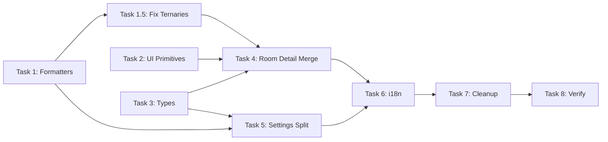

# Codebase Refactor — Structural Cleanup (Option B)

## Goal

Giảm tech debt, tăng code quality bằng cách: eliminate duplicate code (14 fmt functions, 2 RoomDetail views), split monolith Settings.tsx (1,004 dòng), consolidate types, enforce i18n, fix nested ternary anti-patterns.

## Project Type

**WEB** — Tauri desktop app (React + Vite frontend, Rust backend). Refactor chỉ ảnh hưởng frontend TypeScript/TSX.

## Success Criteria

- [ ] Không còn duplicate `fmt`/`fmtMoney` function nào — 1 source duy nhất ở `lib/format.ts`
- [ ] Room Detail chỉ render từ 1 component `RoomDetailPanel` — dùng cho cả Dashboard flow và Rooms flow
- [ ] `Settings.tsx` → tách thành 7+ files, mỗi file < 200 dòng
- [ ] Tất cả user-facing strings dùng `t()` từ i18n system
- [ ] `npm run build` pass, 12 E2E tests pass, không visual regression

---

## File Structure (Sau Refactor)

```
src/
├── lib/
│   ├── utils.ts              (existing — cn() stays)
│   ├── format.ts             [NEW] — fmtMoney, fmtDate, fmtDateShort
│   ├── constants.ts          [NEW] — STATUS_COLORS, STATUS_LABELS, ROOM_TYPE_LABELS
│   └── i18n.ts               (existing — add missing keys)
├── components/
│   ├── shared/
│   │   ├── InfoItem.tsx       [NEW] — extracted from Rooms.tsx + RoomDetail.tsx
│   │   ├── InfoBlock.tsx      [NEW] — extracted from RoomDetail.tsx
│   │   ├── Section.tsx        [NEW] — extracted from RoomDetail.tsx
│   │   └── StatusBadge.tsx    [NEW] — unified status rendering
│   ├── RoomDetailPanel.tsx    [NEW] — unified room detail (sheet + page variants)
│   ├── RoomCard.tsx           (MODIFY — use shared constants)
│   ├── CheckinSheet.tsx       (MODIFY — use lib/format)
│   ├── ReservationSheet.tsx   (MODIFY — use lib/format)
│   └── ...
├── pages/
│   ├── RoomDetail.tsx         [DELETE] — replaced by RoomDetailPanel
│   ├── Rooms.tsx              (MODIFY — use RoomDetailPanel)
│   ├── Dashboard.tsx          (MODIFY — use lib/format, i18n)
│   ├── settings/
│   │   ├── index.tsx          [NEW] — tab layout
│   │   ├── HotelInfoSection.tsx  [NEW]
│   │   ├── RoomConfigSection.tsx [NEW]
│   │   ├── PricingSection.tsx    [NEW]
│   │   ├── AppearanceSection.tsx [NEW]
│   │   ├── DataSection.tsx       [NEW]
│   │   ├── UserManagement.tsx    [NEW]
│   │   └── GatewaySection.tsx    [NEW]
│   ├── Settings.tsx           [DELETE]
│   └── ...
├── types/
│   └── index.ts               [NEW] — consolidated interfaces
└── stores/
    └── useHotelStore.ts       (MODIFY — import types, remove inline interfaces)
```

---

## Tasks

### Task 1: Create Shared Formatting Utilities

**Agent:** `frontend-specialist` | **Skill:** `clean-code`, `code-simplifier`

| | Detail |
|--|--------|
| **INPUT** | 14 duplicate `fmt` functions across 9 files |
| **OUTPUT** | `lib/format.ts` with `fmtMoney()`, `fmtDate()`, `fmtDateShort()` |
| **VERIFY** | `grep -r "new Intl.NumberFormat" src/` returns only `lib/format.ts` |

**Files:**

#### [NEW] `lib/format.ts`
- `fmtMoney(n: number): string` — `Intl.NumberFormat("vi-VN").format(n) + "đ"`
- `fmtDate(iso: string): string` — full date+time format (ex: "17/03/2026, 16:13")
- `fmtDateShort(iso: string): string` — date only (ex: "17/03/2026")

#### [NEW] `lib/constants.ts`
- `STATUS_COLORS: Record<RoomStatus, string>` — badge colors per status
- `STATUS_LABELS: Record<RoomStatus, string>` — display labels per status
- `ROOM_TYPE_LABELS: Record<string, string>` — "deluxe" → "Deluxe"

#### [MODIFY] 13 files — replace local `fmt`/`fmtMoney` with `import { fmtMoney } from "@/lib/format"`
- `pages/RoomDetail.tsx` (line 59)
- `pages/Rooms.tsx` (line 18)
- `pages/NightAudit.tsx` (line 24)
- `pages/Statistics.tsx` (line 45)
- `pages/Guests.tsx` (line 20)
- `pages/Reservations.tsx` (line 142)
- `pages/Analytics.tsx` (line 21)
- `pages/Settings.tsx` (line 31)
- `components/CheckinSheet.tsx` (line 219)
- `components/ReservationSheet.tsx` (line 198)
- `components/GuestProfileSheet.tsx` (line 20)
- `components/RoomCard.tsx` (line 46 — inline)
- `pages/Dashboard.tsx` (lines 101, 133, 217 — inline Intl.NumberFormat + Tooltip formatter)

---

### Task 1.5: Fix Nested Ternary Anti-Patterns

**Agent:** `frontend-specialist` | **Skill:** `code-simplifier`

> Per code-simplifier principle: "Avoid nested ternary operators — prefer switch/if-else for multiple conditions"

| | Detail |
|--|--------|
| **INPUT** | Nested ternaries in 3 files |
| **OUTPUT** | Replaced with readable if/else or helper functions |
| **VERIFY** | `grep -rn '? .* ? .* ?' src/pages/` returns 0 matches |

**Files:**

#### [MODIFY] `pages/Reservations.tsx` (line 111)
```typescript
// BEFORE (nested ternary):
const statusLabel = isBooked ? "Đặt trước" : isActive ? "Đang ở" : isCheckedOut ? "Đã trả" : b.status;

// AFTER (clear if/else):
function getStatusLabel(b): string {
  if (isBooked) return t("status.booked");
  if (isActive) return t("status.active");
  if (isCheckedOut) return t("status.checked_out");
  return b.status;
}
```

#### [MODIFY] `pages/Statistics.tsx` (line 77)
```typescript
// BEFORE: {p === "today" ? "Hôm nay" : p === "week" ? "Tuần" : "Tháng"}
// AFTER: use STATUS_LABELS map or t() calls
```

#### [MODIFY] `pages/Analytics.tsx` (line 80)
```typescript
// BEFORE: {p === "7d" ? "7 ngày" : p === "30d" ? "30 ngày" : "90 ngày"}
// AFTER: use PERIOD_LABELS map
```

#### [MODIFY] `pages/Rooms.tsx` (lines 140-143)
```typescript
// BEFORE: 4-level nested ternary for status badge color
// AFTER: use StatusBadge component from Task 2, or STATUS_COLORS from constants.ts
```

---

### Task 2: Extract Shared UI Primitives

**Agent:** `frontend-specialist` | **Skill:** `clean-code`

| | Detail |
|--|--------|
| **INPUT** | Duplicate `InfoItem`, `InfoBlock`, `Section`, `PaymentBlock` in RoomDetail.tsx and Rooms.tsx |
| **OUTPUT** | `components/shared/` with 4 reusable components |
| **VERIFY** | `grep -r "function InfoItem\|function InfoBlock\|function Section\|function PaymentBlock" src/` returns only `components/shared/*.tsx` |

**Files:**

#### [NEW] `components/shared/InfoItem.tsx`
- Combined `InfoItem` (from Rooms.tsx L220) + `InfoLine` (from RoomDetail.tsx L193)
- Props: `{ label, value, className?, variant?: "inline" | "stacked" }`

#### [NEW] `components/shared/InfoBlock.tsx`
- Extracted from RoomDetail.tsx L202
- Props: `{ label, value }`

#### [NEW] `components/shared/Section.tsx`
- Extracted from RoomDetail.tsx L181
- Props: `{ icon, title, children }`

#### [NEW] `components/shared/StatusBadge.tsx`
- Unified status badge using `lib/constants.ts`
- Props: `{ status: RoomStatus, variant?: "pill" | "badge" }`

---

### Task 3: Consolidate Type Definitions

**Agent:** `frontend-specialist` | **Skill:** `clean-code`

| | Detail |
|--|--------|
| **INPUT** | `RoomDetail` interface in Rooms.tsx (L12-16) duplicates `RoomWithBooking` from store. `BookingWithGuest`, `ActivityItem`, etc. declared inline in Dashboard.tsx |
| **OUTPUT** | `types/index.ts` as single source of truth |
| **VERIFY** | No standalone interface declarations remain in `src/pages/` or `src/components/` (only in `types/` and `stores/`) |

**Files:**

#### [NEW] `types/index.ts`
- Re-export types from `stores/useHotelStore.ts` (`Room`, `Guest`, `Booking`, `RoomWithBooking`, etc.)
- Move `BookingWithGuest`, `ActivityItem`, `ExpenseItem`, `ChartDataPoint`, `RoomAvailability` from `Dashboard.tsx`
- Move `CccdInfo`, `GuestInput`, `GuestSuggestion` from `CheckinSheet.tsx`
- Move `AvailabilityResult`, `EditableBooking` from `ReservationSheet.tsx`
- Move `PricingRuleData`, `GatewayStatus` from `Settings.tsx`

#### [MODIFY] All files that declare local interfaces → import from `@/types`

---

### Task 4: Merge Room Detail Views → Unified `RoomDetailPanel`

**Agent:** `frontend-specialist` | **Skill:** `clean-code`, `frontend-design`

| | Detail |
|--|--------|
| **INPUT** | `pages/RoomDetail.tsx` (241 dòng, full-page) + inline slide-over trong `Rooms.tsx` (L117-208, ~90 dòng) |
| **OUTPUT** | `components/RoomDetailPanel.tsx` — 1 component, 2 modes |
| **VERIFY** | Click room từ Dashboard → full-page detail. Click room từ Rooms → sheet detail. Same component. |

**Depends on:** Task 1, Task 2, Task 3

**Files:**

#### [NEW] `components/RoomDetailPanel.tsx`
- Props: `{ mode: "page" | "sheet"; roomDetail: RoomWithBooking; onBack?: () => void; onClose?: () => void }`
- `mode="page"`: full layout with back button, check-in/checkout actions
- `mode="sheet"`: compact layout, close button, invoice action
- Uses shared components from Task 2 + formatters from Task 1

#### [DELETE] `pages/RoomDetail.tsx`

#### [MODIFY] `pages/Rooms.tsx`
- Remove inline slide-over (L117-208)
- Remove local `RoomDetail` interface (L12-16)
- Remove local `InfoItem` (L220-227)
- Use `<RoomDetailPanel mode="sheet" />`

#### [MODIFY] `App.tsx`
- `detail` tab renders `<RoomDetailPanel mode="page" />` instead of `<RoomDetail />`

#### [MODIFY] `tests/e2e/04-room-detail.test.tsx`
- Update import path: `RoomDetailPanel` from `@/components/RoomDetailPanel`
- Same assertions

---

### Task 5: Split Settings Monolith

**Agent:** `frontend-specialist` | **Skill:** `clean-code`

| | Detail |
|--|--------|
| **INPUT** | `Settings.tsx` — 1,004 dòng |
| **OUTPUT** | `pages/settings/` with 8 files, each < 200 dòng |
| **VERIFY** | `wc -l src/pages/settings/*.tsx` — no file > 200 lines |

**Depends on:** Task 1, Task 3

#### [NEW] `pages/settings/index.tsx` — tab layout (from Settings L33-83)
#### [NEW] `pages/settings/HotelInfoSection.tsx` (~50 lines, from L85-127)
#### [NEW] `pages/settings/RoomConfigSection.tsx` (~180 lines, from L129-398 — form logic only)
#### [NEW] `pages/settings/RoomFormDialog.tsx` (~90 lines — add/edit room modal, extracted from RoomConfigSection)
#### [NEW] `pages/settings/CheckinRulesSection.tsx` (~40 lines, from L400-436)
#### [NEW] `pages/settings/OcrConfigSection.tsx` (~25 lines, from L438-459)
#### [NEW] `pages/settings/AppearanceSection.tsx` (~30 lines, from L461-491)
#### [NEW] `pages/settings/DataSection.tsx` (~55 lines, from L493-548)
#### [NEW] `pages/settings/UserManagement.tsx` (~110 lines, from L552-664)
#### [NEW] `pages/settings/DynamicRoomTypeSelect.tsx` (~25 lines, from L668-687 — shared component)
#### [NEW] `pages/settings/PricingSection.tsx` (~120 lines, from L701-822)
#### [NEW] `pages/settings/GatewaySection.tsx` (~170 lines, from L832-1003)

#### [DELETE] `pages/Settings.tsx`

#### [MODIFY] `App.tsx` — update Settings import
#### [MODIFY] `tests/e2e/08-settings.test.tsx` — update imports if needed

---

### Task 6: Enforce i18n Usage

**Agent:** `frontend-specialist` | **Skill:** `i18n-localization`

| | Detail |
|--|--------|
| **INPUT** | Hardcoded Vietnamese strings: "Đang tải...", "Quay lại", "Tổng tiền", etc. |
| **OUTPUT** | All user-facing strings use `t("key")`, new keys added to `lib/i18n.ts` |
| **VERIFY** | `grep -rn '"Đang tải\|"Quay lại\|"Tổng tiền\|"Có khách' src/pages/ src/components/` → 0 results |

**Depends on:** Task 4, Task 5

#### [MODIFY] `lib/i18n.ts` — add ~30 new keys (RoomDetail, Rooms, CheckinSheet, toast messages)
#### [MODIFY] All pages/components with hardcoded Vietnamese → `t()` calls

---

### Task 7: Dead Code Cleanup

| | Detail |
|--|--------|
| **INPUT** | Residual unused imports/functions/types after Tasks 1-6 |
| **OUTPUT** | Clean codebase |
| **VERIFY** | `npx tsc --noEmit` passes. `npm run build` succeeds. |

**Depends on:** Task 6

---

### Task 8: Full Verification (Phase X)

**Depends on:** Task 7

```bash
# 1. TypeScript — no type errors
npx tsc --noEmit

# 2. Build — production bundle
npm run build

# 3. E2E tests — all 12 files pass
npx vitest run

# 4. Duplication check
grep -r "new Intl.NumberFormat" src/
# → only lib/format.ts

# 5. Monolith check
wc -l src/pages/settings/*.tsx
# → no file > 200 lines

# 6. i18n check
grep -rn '"Đang tải\|"Quay lại\|"Tổng tiền\|"Có khách' src/pages/ src/components/
# → 0 results
```

**Visual Regression (Manual):**
1. `npm run tauri dev`
2. Dashboard → click room → Room Detail page (guest info, payment, actions)
3. Rooms → click room → Sheet slide-over (same data, compact layout)
4. Settings → all tabs load, save works
5. Language switch (vi/en) → strings update

---

## Dependency Graph



> Tasks 1, 2, 3 can run **in parallel**. Task 1.5 depends on Task 1 (needs constants). Task 4 depends on 1.5, 2, 3.

## Notes

- **Backend (Rust) không bị ảnh hưởng** — chỉ frontend refactor
- `RoomConfigSection` giảm từ ~270 → ~180 dòng nhờ tách `RoomFormDialog` (~90 dòng) và `DynamicRoomTypeSelect` (~25 dòng)
- E2E test `04-room-detail.test.tsx` cần update import nhưng assertions giữ nguyên
- Plan đã bổ sung `OcrConfigSection` (bị thiếu ở bản trước)
- Bổ sung Task 1.5 theo code-simplifier skill: fix 4 nested ternary anti-patterns
